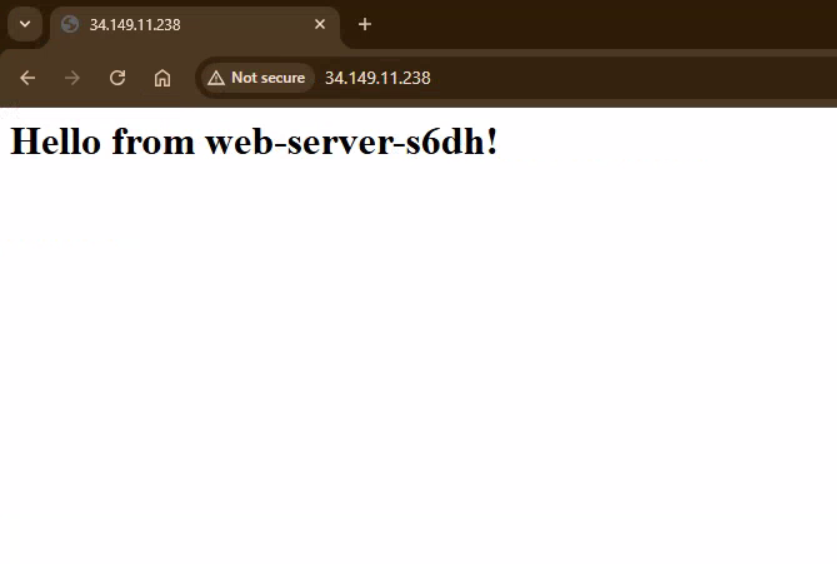
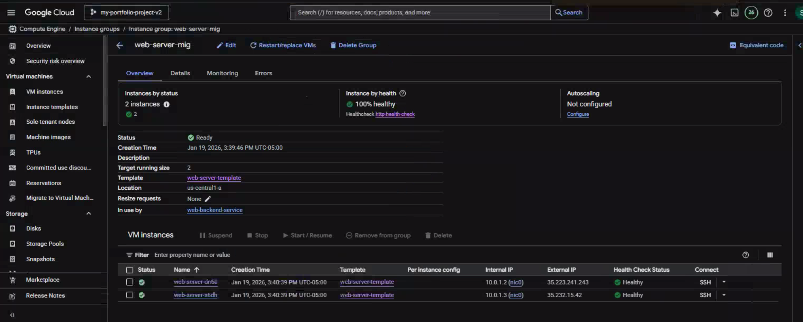

# Project 05: The Resilient, Scalable Web Application

## Objective

The goal of this project was to architect and deploy a production-grade, highly available web application on Google Cloud. This project represents a significant evolution from previous standalone projects by adopting a **reusable, modular Terraform structure, mirroring a real-world enterprise environment.** The system is designed to be scalable, self-healing, and managed entirely through Infrastructure as Code.

---

## Proof of Success

The following screenshot shows a successful connection to the load balancer's public IP, serving a page from one of the backend instances. Refreshing the page routes traffic to the different VMs in the group, proving successful load balancing.

The health checks for the Managed Instance Group (MIG) are passing, confirming that the load balancer can correctly identify healthy instances to route traffic to.

---

## Architecture & Design Choices

This project was built using a professional, modular Terraform structure to promote reusability and best practices.

*   **Reusable VPC Module:** **As a deliberate step towards enterprise-grade IaC, all network resources (VPC, subnet, firewall rules) were abstracted into a reusable module.** The main project calls this module to create a secure and consistent network foundation, demonstrating the "Don't Repeat Yourself" (DRY) principle.
*   **Instance Template:** A single, immutable blueprint defines the configuration for all web server VMs, ensuring consistency across the instance group.
*   **Managed Instance Group (MIG):** The MIG automatically manages the lifecycle of the web server VMs. It is configured with `target_size = 2` for high availability and an auto-healing policy linked to a health check, allowing it to automatically replace failed instances.
*   **Global HTTP Load Balancer:** A full load balancing stack (Forwarding Rule -> Target Proxy -> URL Map -> Backend Service -> Health Check) distributes traffic evenly across the healthy instances in the MIG.
*   **Startup Script:** A separate `startup.sh` file is used with Terraform's `file()` function for robust, cross-platform script execution to bootstrap each VM with the Nginx web server.

---

## Key Learnings & Epic Debugging Journey

This project was a masterclass in real-world cloud troubleshooting and professional IaC practices.

*   **Modular Terraform Design:** I successfully transitioned from monolithic, standalone project files to a reusable, modular structure. This involved creating a dedicated VPC module with its own variables and outputs, and then instantiating that module from a separate "live" project directory. This is the standard for managing complex infrastructure in an enterprise setting.
*   **Deep System Debugging:** The initial deployment failed due to a series of complex, interconnected issues. I systematically debugged the entire stack, from the network firewall up to the application layer on the VM itself.
*   **The Final Root Cause:** After investigating firewall rules, health checks, and network tags, I used SSH and `journalctl` to access the VM's startup logs. I discovered the root cause was an `exec: format error`, indicating a cross-platform line-ending issue.
*   **The Professional Solution:** I resolved the script failure by refactoring the code to use the industry-standard `file()` function, which loads the script from a separate `.sh` file, ensuring correct formatting and a reliable deployment.

This journey demonstrates not only the ability to build a complex cloud architecture, but also the critical engineering skill of debugging and solving problems across multiple layers of the technology stack.

---

## How to Run

*(This section remains the same)*

1.  Navigate to this project directory: `cd projects/05-scalable-web-app`
2.  Initialize Terraform: `terraform init`
3.  Review the execution plan: `terraform plan`
4.  Apply the configuration: `terraform apply`