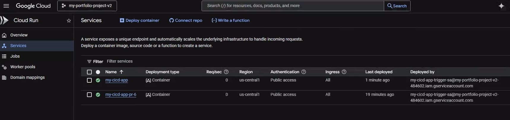

# Project 06: The Enterprise-Grade CI/CD Pipeline

## Objective

The goal of this project was to architect and deploy a fully automated, production-ready CI/CD system on Google Cloud. This project represents a significant evolution from static infrastructure deployment by embracing a **complete "source-to-prod" automation workflow, mirroring a real-world enterprise DevOps environment.**

The system features parallel pipelines to handle both production deployments and ephemeral developer preview environments, automatically building and deploying a containerized web application from a single `git push` or `pull request`, managed entirely through Infrastructure as Code.

---

## Proof of Success

The following screenshot shows the live web application being served by Cloud Run after a successful, fully automated deployment to the `main` branch.

The Cloud Build history shows a complete, successful pipeline run. Each stage—building the container, pushing it to Artifact Registry, and deploying to Cloud Run—is marked with a green check, providing a clear audit trail of the automated process.

### Pull Request Preview Environment

The system also automatically creates temporary preview environments for each Pull Request. The screenshot below shows a successful PR check on GitHub, and the corresponding ephemeral service created in Cloud Run, allowing for isolated testing and review before merging.

## Architecture & Design Choices

This project was built using a professional, modular Terraform structure to create a secure, scalable, and automated deployment system.

*   **Dual-Pipeline CI/CD Architecture:** The system uses two parallel Cloud Build triggers to differentiate between development and production workflows.
    *   A **`push` trigger** on the `main` branch automatically deploys verified code to the primary production service.
    *   A **`pull_request` trigger** automatically spins up a temporary, isolated preview environment for every new PR, enabling robust testing and review before merging.

*   **Enterprise Artifact Strategy:** The pipeline enforces security and traceability by using a private Artifact Registry repository with **tag immutability enabled**. To support this, builds are tagged with unique identifiers (`$SHORT_SHA` for production, `pr-$${_PR_NUMBER}-$SHORT_SHA` for previews) instead of mutable tags like `:latest`.

*   **Security & The Principle of Least Privilege:** A **dedicated, custom service account** is created specifically for the CI/CD pipeline. It is granted only the exact IAM roles it needs to perform its job (`run.admin`, `artifactregistry.writer`, `cloudbuild.builds.builder`, `logging.logWriter`), strictly adhering to this core security principle.

*   **Modular, Application-Focused IaC:** As a deliberate step towards enterprise-grade IaC, this architecture introduces higher-level modules like `cloud-run-service` and `cloud-build-cicd`. This abstraction allows application teams to deploy services without needing to know the underlying implementation details, demonstrating a key platform engineering practice.

*   **Containerization & Serverless:** The application is containerized with Docker for runtime consistency and deployed to **Cloud Run**, a fully managed serverless platform. This provides automatic scaling (including to zero), eliminates server management, and reduces operational overhead.

---

## Key Learnings & Epic Debugging Journey

This project was a masterclass in real-world troubleshooting, spanning the full stack from cloud infrastructure permissions to advanced Git workflows. The initial "happy path" build was just the beginning; the real learning came from diagnosing and solving a cascade of enterprise-level challenges.

*   **Solved Silent IAM Permission Failure:** The most significant challenge was diagnosing why preview environments returned a `403 Forbidden` error despite a successful Cloud Build run. I discovered this was a silent failure: the `run.developer` role allowed the pipeline to *deploy* the service but lacked the `run.services.setIamPolicy` permission to make it public. **The fix was to elevate the service account's privileges by granting the `roles/run.admin` role**, a critical lesson in the nuances of GCP's predefined roles.

*   **Implemented Enterprise Artifact Versioning Strategy:** The `main` branch pipeline initially failed with a `manifest invalid: cannot update tag` error. This was because the security best practice of **tag immutability** was enabled, which prevents overwriting tags like `:latest`. I re-architected the build process to use dynamic, unique tags for every build (`$SHORT_SHA` for `main` and `pr-$${_PR_NUMBER}-$SHORT_SHA` for previews), ensuring a traceable and secure artifact history.

*   **Mastered Infrastructure State Drift and Forced Updates:** At one point, the live Cloud Build trigger was stuck on an old, broken configuration, but `terraform plan` reported "No changes." This is a classic and difficult "state drift" problem. I resolved it by using a targeted `terraform destroy -target` command to manually destroy the faulty resource in the cloud, forcing Terraform to recreate it from scratch using the correct, updated code on the next `apply`.

*   **Resolved Complex Git Merge Conflicts:** The process of developing fixes on multiple feature branches (`feature/pr-preview-trigger`, `chore/change-to-unique-tags`) inevitably led to a `merge conflict`. I successfully resolved this conflict in the GitHub UI by manually constructing a final, correct version of the file that incorporated all fixes, demonstrating a key skill for collaborative development.

*   **Deepened Terraform Expertise:** I encountered and fixed several subtle Terraform configuration errors, such as escaping Cloud Build substitution variables (`$${_PR_NUMBER}`) to prevent Terraform from interpreting them, and correctly constructing repository resource names (`${var.github_owner}-${var.github_repo_name}`) to match GCP's auto-generated naming scheme.

This journey demonstrates not only the ability to architect a complex, automated system but also the critical engineering skill of debugging and solving non-obvious problems across multiple layers of the technology stack.

---

## How to Run

1.  Navigate to this project directory: `cd projects/06-automated-container-deployment`
2.  Create a `terraform.tfvars` file with your `project_id`, `github_owner`, `connection_name`, etc.
3.  Initialize Terraform: `terraform init`
4.  Apply the configuration to build the CI/CD infrastructure: `terraform apply`
5.  **Trigger the pipelines:**
    *   **Production Pipeline:** Make a code change inside the `apps/` directory and push it to the `main` branch on GitHub.
    *   **Preview Pipeline:** Create a new branch, make a code change, push the branch, and open a Pull Request targeting `main`.