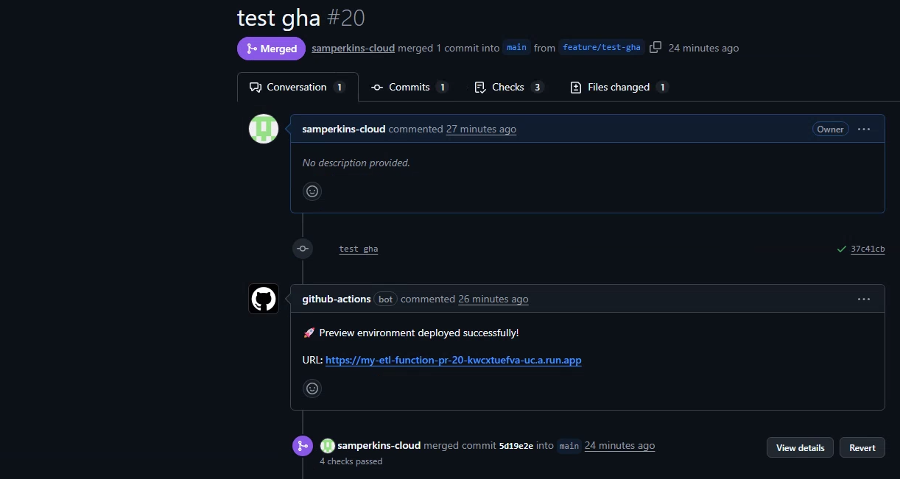
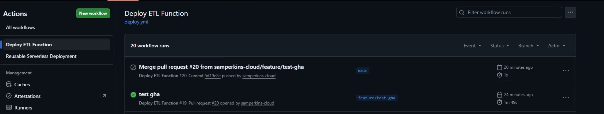
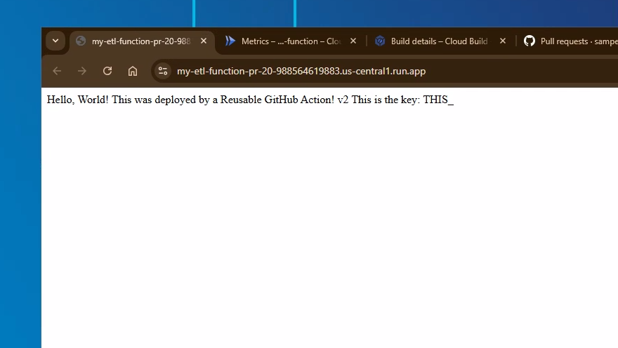

# Project 08: The Reusable CI/CD Platform for Serverless Applications

## Objective

This project represents the final evolution of a CI/CD pipeline into a true, reusable **DevOps platform**, built on **GitHub Actions**. The goal was to refactor the entire system to align with a modern, enterprise-grade "platform engineering" model, as discussed with senior cloud architects.

This showcases a key enterprise capability: creating a flexible, secure, and automated "paved road" that different development teams can consume without needing deep DevOps expertise. The platform is built on a **reusable GitHub Actions workflow**, authenticates to GCP using secure, **keyless Workload Identity Federation**, and is structured into distinct **Platform and Application workspaces** using Terraform Cloud.

---

## Proof of Success

The final platform provides a complete, automated, and secure developer experience.

A developer opens a Pull Request, and the reusable GitHub Actions workflow automatically triggers. It builds the code, deploys a temporary preview environment, and **posts a comment back to the PR with a live URL**, closing the feedback loop.

The workflow run itself shows a successful execution of the `deploy-preview` job, including authentication, building, deploying, and commenting.

The resulting preview service is live on Cloud Run, correctly configured with public access and running the code from the PR branch.

---

## Architecture & Design Choices

This project was re-architected into a professional, multi-workspace platform that separates platform concerns from application concerns.

*   **GitHub Actions Reusable Workflow:** The core of the platform is a **reusable workflow** (`reusable-deploy-function.yml`) that lives in a central `.github/workflows` directory. This workflow contains all the logic for authentication, building, and deploying. Application teams consume this platform by creating a simple "caller" workflow that passes in a few parameters.

*   **Secure Keyless Authentication (WIF):** The platform authenticates to Google Cloud using **Workload Identity Federation (WIF)**. This is the industry best practice for security, as it allows GitHub Actions to impersonate a GCP Service Account using short-lived OIDC tokens instead of storing long-lived JSON service account keys as secrets.

*   **Platform & Application Workspace Separation:** The infrastructure is managed across two distinct Terraform Cloud workspaces, modeling a real-world enterprise structure:
    1.  **`09-platform-foundations` (The Platform):** Owned by "Cloud Engineering," this workspace uses Terraform to provision foundational resources like dedicated application Service Accounts and their secrets. It securely exposes the IDs of these resources via remote state outputs.
    2.  **`08-automated-functions-deployment` (The Application):** This workspace is the "consumer." It uses a `terraform_remote_state` data source to read the outputs from the platform workspace, providing the CI/CD pipeline with the identity and secrets it needs to deploy the application.

*   **Explicit, Secure Build Process:** The GitHub Actions workflow uses an explicit, three-step process (`docker build`, `docker push`, `gcloud run deploy`) rather than relying on implicit "magic" commands. This provides granular control, allowing for the future injection of security scanning (e.g., Trivy, Artifact Analysis) and attestation (e.g., Binary Authorization) steps.

*   **Monorepo-Aware Triggers:** The "caller" workflow uses a `paths` filter, ensuring that the pipeline only runs when code changes are detected within its specific project directory (e.g., `projects/08-automated-functions-deployment/apps/**`).

---

## Key Learnings & Epic Debugging Journey

This project was a masterclass in debugging the complex interactions between Git, GitHub Actions, Terraform, and GCP. The journey went far beyond simple syntax errors into the deep, underlying mechanics of a modern cloud platform.

*   **Mastered GitHub Actions Workflows:** Successfully debugged a series of complex YAML syntax and logic errors, including:
    *   **Pathing Issues:** Corrected workflow file locations, moving them to the root `.github/workflows` directory.
    *   **Permission Handshake:** Resolved "permission denied" errors by correctly granting `contents: read`, `pull-requests: write`, and `id-token: write` permissions to the "caller" workflow so it could delegate them to the reusable workflow.
    *   **Input Typos:** Fixed `Unexpected input(s)` errors by providing the correct input names (e.g., `service_account` vs. `service_account_email`) to the Google Auth action.

*   **Solved Advanced IAM Handoff Failure:** The most complex bug was a `Permission denied on secret` error. I diagnosed that the error was happening *after* deployment, when the **Cloud Run service's runtime identity** tried to access the secret. **The fix was to add the `--service-account` flag to the `gcloud run deploy` command**, explicitly telling the service to run as a dedicated SA, and granting that SA the `iam.serviceAccountUser` role on itself.

*   **Mastered Container Runtime Contracts:** A persistent `Container Healthcheck failed` error led to a deep dive into the Cloud Run contract. **The final solution was to re-architect the `Dockerfile`'s `CMD` instruction to the canonical `CMD ["/bin/sh", "-c", "exec ... --port=$PORT"]` pattern**, creating a standard, portable container that correctly listens on the port provided by the Cloud Run environment.

*   **Mastered Multi-Workspace Terraform Architecture:** Successfully refactored the entire infrastructure into a "platform" and "application" model. This involved solving `Undeclared resource` errors by passing outputs from one workspace as variables to another, and using `terraform state rm` to safely migrate resources between workspaces without causing destructive plans.

This journey proves the ability to not only architect a complex, automated system but also to systematically debug and solve the complex, non-obvious issues that arise in a real-world, enterprise-grade cloud platform.

---

## How to Run

This project now uses a Git-native workflow. The infrastructure is managed across two workspaces.

1.  **Deploy the Platform:**
    *   Navigate to `projects/09-platform-foundations`.
    *   Configure the `terraform.tfvars` file.
    *   Run `terraform init` and `terraform apply` to create the foundational resources.
2.  **Configure the Application Workspace:**
    *   Navigate to `projects/08-automated-functions-deployment`.
    *   Run `terraform init`. The plan should show no changes, as it reads its configuration from the platform workspace.
3.  **Trigger the CI/CD Pipeline:**
    *   Create a new branch.
    *   Make a code change inside `projects/08-automated-functions-deployment/apps/`.
    *   Push the branch and open a Pull Request to trigger the preview deployment workflow.