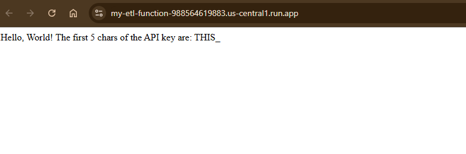
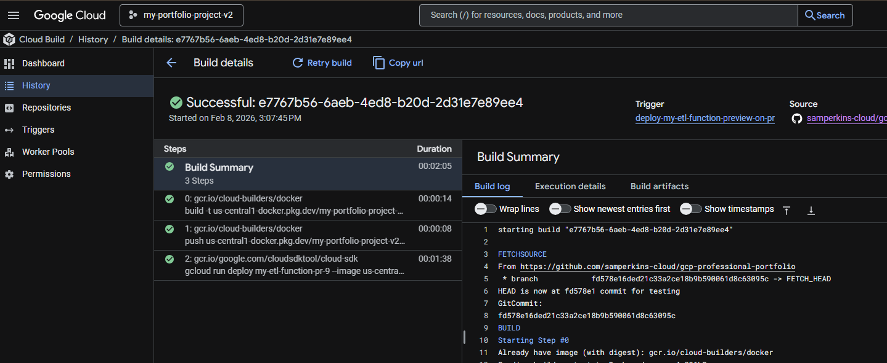
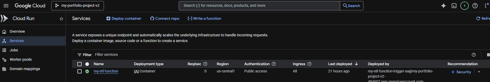

# Project 08: The Adaptable CI/CD Platform for Serverless Functions

## Objective

This project demonstrates the evolution of a CI/CD pipeline into a true, reusable **DevOps platform**. The goal was to adapt the architecture from Project 06 to serve a completely different use case: the automated deployment of a containerized ETL function.

This showcases a key enterprise capability: creating a flexible, secure, and automated "paved road" that different development teams (e.g., Data Engineering) can use to deploy their applications without needing deep DevOps expertise. The system implements secure secret management, advanced IAM roles, and intelligent, path-based trigger filtering for a monorepo environment.

---

## Proof of Success

The live Cloud Function, deployed as a Cloud Run service, successfully retrieves and displays a portion of a value from Secret Manager. This demonstrates the end-to-end success of the secure workflow, including the service account permissions and secret retrieval.

The Cloud Build history confirms a successful, targeted pipeline execution. The build was correctly initiated by a change in this project's directory, while changes in other directories were ignored, highlighting the effectiveness of the path-based trigger filtering.

The Cloud Run console displays the deployed my-etl-function service. It is correctly configured to run with a custom service account and allows public access for its trigger URL, as intended.

---

## Architecture & Design Choices

This project extends the architecture of Project 06, adding layers of security, intelligence, and reusability to create a true platform.

*   **Adaptable CI/CD Pattern:** The core three-step pipeline (`docker build`, `docker push`, `gcloud run deploy`) proved to be a universal pattern, successfully deploying a Python Functions Framework application as a standard, portable container to Cloud Run, demonstrating the link between 2nd Gen Cloud Functions and Cloud Run.

*   **Secure Secret Management:** The platform provides a secure, end-to-end workflow for secrets.
    1.  A secret is created in **Google Secret Manager** by a foundational Terraform workspace.
    2.  The pipeline's Service Account is granted the **`secretmanager.secretAccessor`** role.
    3.  The `gcloud run deploy` command uses the **`--set-secrets`** flag to securely inject the secret into the running container as an environment variable.
    4.  The application code reads the secret from the environment, never needing to know the actual value.

*   **Monorepo-Aware Triggers:** To prevent every push to `main` from triggering all pipelines, the Cloud Build triggers were upgraded with an **`included_files`** filter. Now, each pipeline only runs if code changes are detected within its specific project directory (e.g., `projects/08-automated-functions-deployment/apps/**`).

*   **Advanced IAM & The Principle of Least Privilege:** This project required a deeper implementation of least-privilege. In addition to previous roles, the Service Account was granted:
    *   **`cloudfunctions.developer`**: To allow the pipeline to manage the lifecycle of Cloud Functions.
    *   **`iam.serviceAccountUser` (on itself)**: A critical permission to allow the pipeline to assign its own identity to the Cloud Run service at deploy time, solving a complex "two service account" problem.

*   **Modular & Specialized IaC:** To support this new application type, a new, specialized Terraform module (`cloud-build-cicd-functions`) was created. This proves the original design was extensible and promotes the creation of a library of reusable components for different platform consumers.

---

## Key Learnings & Epic Debugging Journey

This project was a masterclass in debugging the complex interactions between services in a modern cloud platform. The journey went far beyond simple syntax errors into the deep, underlying mechanics of GCP and IaC.

*   **Solved Advanced IAM Handoff Failure:** The most complex bug was a `Permission denied on secret` error, even though the pipeline's service account had the correct role. I diagnosed that the error was happening *after* deployment, when the **Cloud Run service's runtime identity** (which defaulted to the Compute Engine SA) tried to access the secret. **The fix was to add the `--service-account` flag to the `gcloud run deploy` command**, explicitly telling the service to run as our custom SA, and granting that SA the `iam.serviceAccountUser` role on itself.

*   **Mastered Container Runtime Contracts:** A persistent `Container Healthcheck failed` error led to a deep dive into the Cloud Run contract. I discovered the conflict between the `gcloud functions deploy` command's assumptions and the `gcloud run deploy` health checks. **The final solution was to re-architect the `Dockerfile`'s `CMD` instruction to the canonical `CMD ["/bin/sh", "-c", "exec ... --port=$PORT"]` pattern**, creating a standard, portable container that correctly listens on the port provided by the Cloud Run environment.

*   **Debugged Application-Level Failures:** The final errors were not in the infrastructure but in the application code itself. By analyzing the runtime logs from the failed container, I diagnosed and fixed both an `ImportError` (from a deprecated `flask` function) and a Python `IndentationError`, demonstrating full-stack problem ownership.

*   **Mastered Advanced Terraform Module Design:** This project required a deeper understanding of module architecture. I solved an `Undeclared resource` error by refactoring the code to pass the `secret_id` into the module as a variable, correctly enforcing the "black box" principle where modules cannot see resources created outside of them.

This journey proves the ability to not only adapt an architecture for a new purpose but also to systematically debug and solve the complex, non-obvious issues that arise in a real-world, enterprise-grade cloud platform.

---

## How to Run

1.  Navigate to this project directory: `cd projects/08-automated-functions-deployment`
2.  Create a `terraform.tfvars` file with your `project_id`, `github_owner`, `connection_name`, and the secret `app_api_key`.
3.  Initialize Terraform: `terraform init`
4.  Apply the configuration to build the CI/CD infrastructure: `terraform apply`
5.  **Trigger the pipelines:**
    *   **Production Pipeline:** Make a code change inside `projects/08-automated-functions-deployment/apps/` and push it to the `main` branch.
    *   **Preview Pipeline:** Create a new branch, make a code change in the same directory, push the branch, and open a Pull Request.